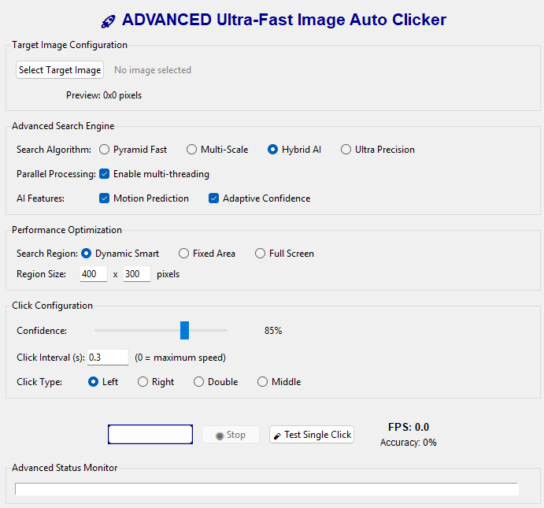

# 🚀 Advanced Ultra-Fast Image Auto Clicker

<div align="center">


**Intelligent image recognition auto-clicker with global hotkeys and advanced search algorithms**

</div>

## ✨ Features

### 🎯 Advanced Image Recognition
- **Multi-Scale Search**: Detect targets at different sizes and orientations
- **Pyramid Algorithm**: Fast hierarchical searching for optimal performance
- **Hybrid AI Engine**: Combines multiple matching methods for maximum accuracy
- **Dynamic Region Optimization**: Smart search area prediction

### ⌨️ Global Hotkey System
- **Customizable Hotkeys**: Set your own start/stop key combinations
- **Background Operation**: Works while application is minimized
- **Cross-Platform Support**: Consistent hotkey behavior

### ⚡ Performance Optimized
- **Real-time FPS Monitoring**: Live performance metrics
- **Adaptive Confidence**: Self-adjusting detection thresholds
- **Smart Caching**: Position prediction and memory optimization
- **Multi-threaded**: Non-blocking UI with smooth operation

### 🎮 User-Friendly Interface
- **Modern GUI**: Intuitive Tkinter-based interface
- **Image Preview**: Visual target selection
- **Real-time Logging**: Detailed operation status
- **One-Click Testing**: Instant verification of settings

## 📸 Preview



## 🚀 Quick Start

### Prerequisites
- Python 3.7 or higher
- Windows/Linux/Mac OS
- Administrative privileges (for global hotkeys)

### Installation

1. **Clone the repository**

```bash
git clone https://github.com/elouardighi/advanced-auto-clicker.git
cd advanced-auto-clicker

2. **Install dependencies**

bash
pip install -r requirements.txt

1. **Run the application**

bash
python autoclicker.py
